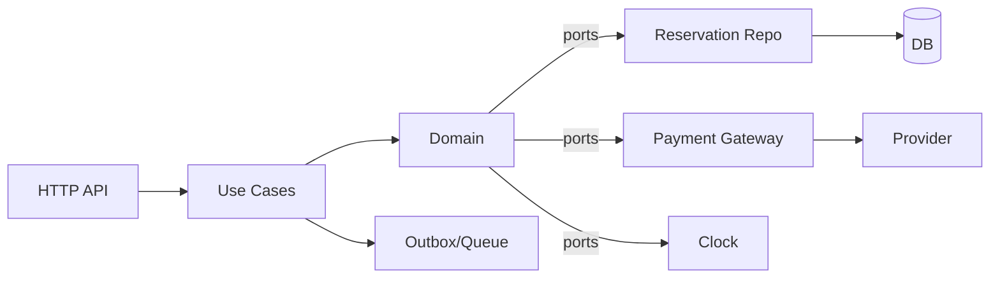

# MGI Tickets - Documento de diseno

## 1. Vision general
El sistema vende entradas de eventos con alta concurrencia. La prioridad es evitar sobreventa, permitir reservas temporales y manejar fallos parciales sin perder integridad. Se propone arquitectura hexagonal (ports & adapters) con DDD:

- Dominio aislado (reglas de negocio y estados de reserva/compra).
- Aplicacion (casos de uso y orquestacion).
- Infraestructura (DB, pagos, colas, reloj, cache).
- Interfaces (HTTP, eventos, tareas programadas).

## 2. Objetivos y no-objetivos
Objetivos:
- No sobreventa bajo alta concurrencia.
- Reservas con expiracion controlada.
- Confirmacion idempotente de pagos.
- Liberacion automatica de reservas vencidas.
- Experiencia consistente y predecible.

No-objetivos:
- Implementar catalogo completo, UI o facturacion.
- Integracion real con pasarela de pagos (solo contrato).

## 3. Modelo de dominio (entidades y estados)

### Entidades
- Event: id, nombre, fecha, venue.
- TicketType: id, eventId, tipo (numerado/general), zona, precio, capacidad.
- Seat: id, eventId, zona, numero (solo numerados).
- Reservation: id, eventId, ticketTypeId, items, status, expiresAt, userId.
- Order: id, reservationId, amount, status, paymentId.
- Payment: id, orderId, status, providerRef.

### Value Objects
- Money, Quantity, SeatId, TicketTypeId.

### Estados clave
- ReservationStatus: PENDING, CONFIRMED, EXPIRED, CANCELLED.
- OrderStatus: PENDING, PAID, FAILED, CANCELLED.
- PaymentStatus: AUTHORIZED, CAPTURED, DECLINED, TIMEOUT, DUPLICATED.

### Invariantes
- Capacidad nunca negativa.
- Una reserva activa consume capacidad.
- Confirmar pago solo una vez (idempotencia).

## 4. Flujos principales

### 4.1 Reservar entradas (con expiracion)
1) Usuario solicita reservar (ticketTypeId, cantidad, seats opcional).
2) Caso de uso valida disponibilidad.
3) Persistencia atomica de la reserva y decremento de inventario.
4) Se devuelve reservationId y expiresAt.

### 4.2 Confirmacion de compra
1) Usuario inicia pago con reservationId.
2) Se crea Order y Payment en PENDING.
3) Webhook del proveedor confirma pago.
4) Caso de uso confirma Reservation -> CONFIRMED y Order -> PAID.
5) Se emiten entradas.

### 4.3 Expiracion y liberacion
1) Job periodico busca reservas vencidas.
2) Cambia status a EXPIRED y libera inventario.

## 5. Estrategia para evitar sobreventa

### Numeradas (asientos)
- Cada asiento es unico y reservable una sola vez.
- Bloqueo por fila (DB) o constraint unico (seatId, status activo).

### Generales (aforo)
- Inventario por TicketType con contador disponible.
- Actualizacion atomica: UPDATE ... SET available = available - :n WHERE available >= :n.
- Operacion dentro de transaccion.

### Concurrencia
- Unidades de reserva son pequeñas y transaccionales.
- En casos extremos, usar cola de comandos o token bucket para admission control.

## 6. Manejo de fallos parciales
- Pagos duplicados: idempotencia con paymentId y providerRef.
- Pagos tardios: validar reservationId y status antes de confirmar.
- Timeouts: PaymentStatus TIMEOUT, reintentos seguros.
- Caidas parciales: Outbox pattern para eventos y reintentos.

## 7. Arquitectura (hexagonal)

## 8. Puertos (interfaces del dominio)
- ReservationRepository: save, findById, expireDue.
- InventoryRepository: reserveSeats, reserveQuantity, release.
- PaymentGateway: authorize, capture, validateWebhook.
- Clock: now().
- EventPublisher: publishReservationExpired, publishOrderPaid.

## 9. Supuestos y trade-offs
- Se prioriza consistencia fuerte en reservas sobre latencia.
- DB relacional para transacciones y constraints.
- Cache solo para lectura, no para fuente de verdad.
- Jobs de expiracion pueden ser cada 30-60s.

## 10. Edge cases considerados
- Miles de usuarios sobre misma entrada: se rechaza si no hay inventario.
- Abandono de pago: reserva expira y libera.
- Pagos tardios/duplicados: idempotencia y validacion de estado.
- Caidas parciales: reintentos con outbox.
- Reintentos del usuario: usar idempotency key.
